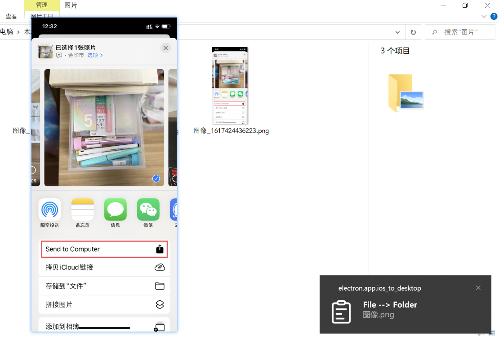

#### Transfer Photos from iOS to Win on one click

##### Features



* iOS clipboard  -->  Windows clipboard
* iOS photo --> Windows folder
* [Video demo](https://youtu.be/UPjAv-dKj6A)


##### How it work

​	Use express create a local http sever in your computer, so your can send photos from your iPhone to computer with a POST request.


##### Install

* [windows setup](https://github.com/arnosolo/send_ios_photos_to_win/releases)


##### Dev

* dev

  ```shell
  git clone https://github.com/arnosolo/send_ios_photos_to_win.git
  npm install
  npm start
  ```

* pack

  ```shell
  npm run dist
  ```


